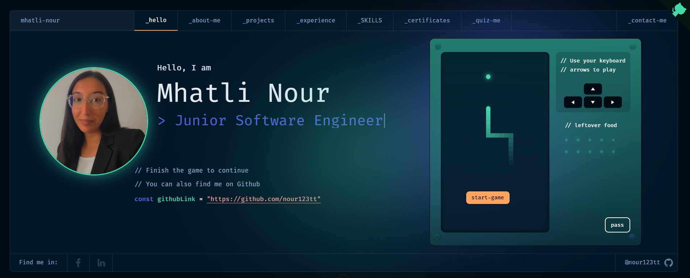

<h1 align="center">
  Mhatli Nour — Portfolio
</h1>
<p align="center">
  Portfolio personnel de <b>Mhatli Nour</b>, développeuse logicielle full-stack (Angular, Spring Boot, Python). Construit avec <a href="https://nuxt.com/" target="_blank">Nuxt 3</a> et déployé sur <a href="https://vercel.com/" target="_blank">Vercel</a>.
</p>

<p align="center">
  <a href="https://my-portfolio-eight-sigma-33.vercel.app" target="_blank">
    
  </a>
</p>

<p align="center">
  🔗 <a href="https://my-portfolio-eight-sigma-33.vercel.app" target="_blank"><b>Voir le site en ligne</b></a>
</p>

## À propos

Diplômée en Génie Logiciel de Polytech International, je suis actuellement développeuse freelance à la recherche de mon prochain défi professionnel. Ce portfolio met en avant mon expérience full-stack, mes projets académiques et professionnels, mes compétences techniques, ainsi que mes centres d'intérêt.

## Fonctionnalités

- **Accueil interactif** avec mini-jeu Snake intégré
- **À propos de moi** : bio, centres d'intérêt, parcours éducatif
- **Projets** filtrables par technologie
- **Expérience professionnelle** avec galerie d'images par projet
- **Compétences** présentées dans une interface de bureau interactive
- **Certificats** affichés sur un tableau d'affichage animé
- **Quiz** pour découvrir mon parcours de façon ludique
- **Contact** avec formulaire d'envoi d'e-mail direct

## 🛠 Installation

1. Cloner le projet sur ta machine locale.
```sh
git clone https://github.com/nour123tt/my-portfolio.git
```
2. Se déplacer dans le dossier du projet
```sh
cd my-portfolio
```
3. Installer les dépendances
```sh
yarn install
```
4. Lancer le serveur de développement
```sh
yarn dev
```
5. Le serveur de développement sera disponible sur <a href="http://localhost:3000/">http://localhost:3000/</a>

## ✒️ Personnalisation

Le contenu du portfolio est principalement piloté par le fichier `developer.json` à la racine du projet, qui contient les informations affichées : *projets*, *expériences*, *compétences*, *certificats*, *quiz*, *recommandations* et coordonnées de *contact*.

- `nuxt.config.ts` : configuration des meta tags et paramètres du site.
- `public/pwa/manifest.json` : configuration PWA.

## 🚀 Build et exécution en production

1. Générer un build de production
```sh
yarn build
```
2. Prévisualiser le site tel qu'il apparaîtra une fois déployé
```sh
yarn preview
```

## Stack technique

- [Nuxt 3](https://nuxt.com/)
- [Vue 3](https://vuejs.org/)
- [Tailwind CSS](https://tailwindcss.com/)
- [Vercel](https://vercel.com/)

## Contact

- **Email :** m.nour23165@pi.tn
- **LinkedIn :** [linkedin.com/in/mhatlinour](https://www.linkedin.com/in/mhatlinour/)
- **GitHub :** [github.com/nour123tt](https://github.com/nour123tt)

---

<p align="center">
  <sub>Basé sur le concept <a href="https://www.figma.com/community/file/1100794861710979147" target="_blank">Portfolio for Developers V.2</a>, designé par <a href="https://www.behance.net/darelova" target="_blank">@darelova</a> et développé initialement par <a href="https://github.com/alexdeploy">@alexdeploy</a>.</sub>
</p>

## License

Ce projet est sous licence MIT. Voir le fichier <a href="./LICENSE">LICENSE</a> pour plus d'informations.